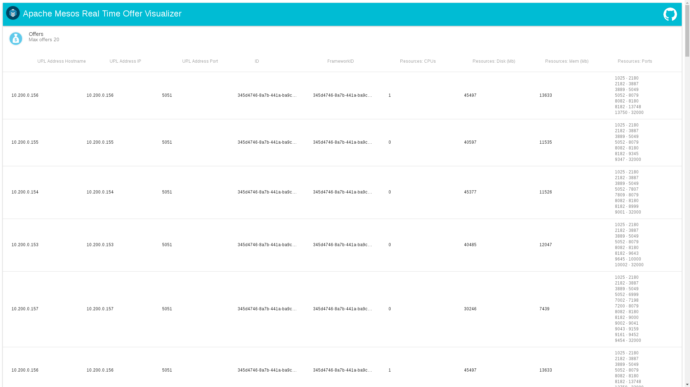

# Real time Offer logger for Mesos


A Mesos scheduler to launch using Marathon that shows every offer that is being launched in a Mesos cluster and expose them in a web view.

The idea is to build from ground a debugging tool to help in the diagnose of errors while developing Mesos frameworks, executors or simply running tasks.

## Requirements
* Go installed and configured
* Git
* NPM

## How to use
* Clone repo

```bash
git clone https://github.com/Stratio/real-time-mesos-offers-logging.git
cd real-time-mesos-offers-logging
```

* Download front packages

```bash
npm install
```

* Execute giving it a URL to Mesos master zookeeper and a port to launch the server

```bash
go run main.go --master=zk://10.200.0.152:2181/mesos --port 9095 --hostname 0.0.0.0
```

* Open a browser that points to the host. You should see something like this